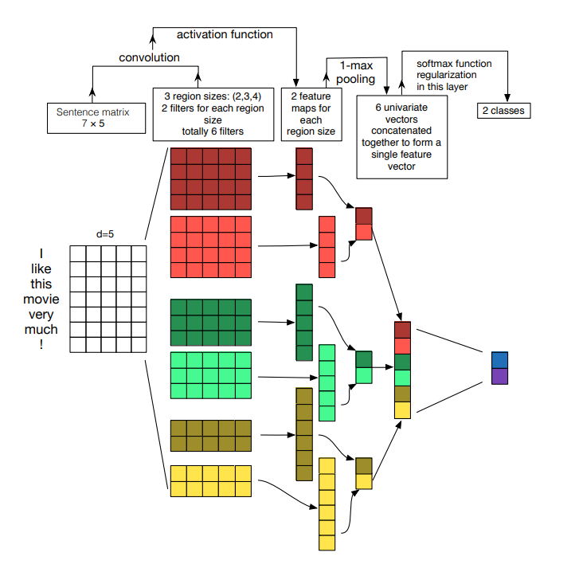

# CNN을 이용한 한국어 영화 리뷰 감정 분석기

- CNN을 활용한 한국어 영화 리뷰 감정 분석기

## Requirements
- Keras
- Numpy
- [BPEmb](https://github.com/bheinzerling/bpemb)
  
## Dataset
- [Naver Sentiment Movie Corpus v1.0](https://github.com/e9t/nsmc)

## Performance
|(2,3,4,5)|(7,7,7,7)|
|:---:|:---:|
|Acc|-|-|

-|-|-|-
|:---:|:---:|:---:|:---:|:---:
(2,3,4,5)+PT|(7,7,7,7)+PT|(2,3,4,5)+PT(Trainable)|(7,7,7,7)+PT(Trainable)
KEY | VALUE 
:--------------:|:------------------------------------------------------------------------------------------------------------
피고인 | '망 피고인 1 외 2인'
    
## Reference
- [A Sensitivity Analysis of (and Practitioners' Guide to) Convolutional Neural Networks for Sentence Classification](https://arxiv.org/abs/1510.03820)

## License
